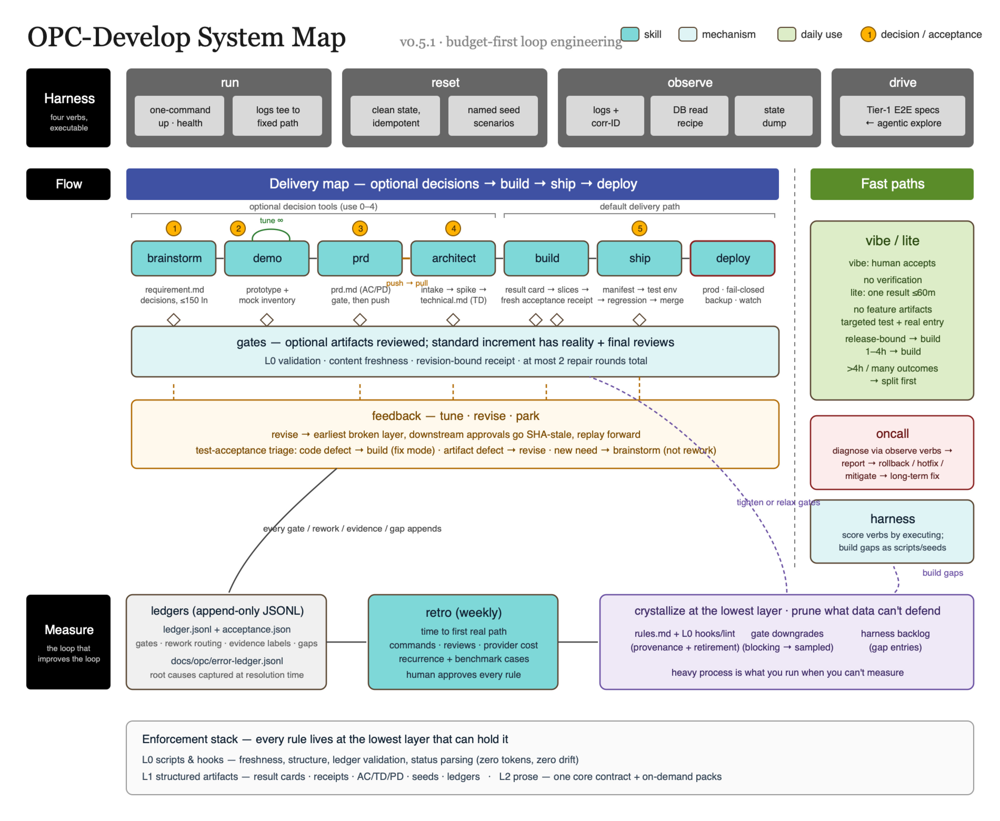

# opc-develop

[简体中文](README.zh-CN.md)

opc-develop is a product-development skill suite for Claude Code and Codex. It is not one heavy
pipeline that every project must run end to end. It is a set of routes that compose by situation:
use `lite` for a daily small change, `build` for a standard product increment, opt into decision
skills only when product or architecture judgment is unresolved, and enter separate safety flows
for release and incidents.

Its core promise is: **prove one real user journey first, then use evidence bound to the current
revision to say exactly how complete the result is.** The human still owns product judgment, design
taste, and architecture direction. The agent implements and verifies inside those boundaries.

> Version 0.5 changed the default route; it did not remove the architecture. The Harness,
> delivery, feedback, measurement, and rule-crystallization loops still exist. `brainstorm`,
> `demo`, `prd`, and `architect` moved from mandatory predecessors to opt-in decision tools.

## Who it is for

opc-develop is for people who personally own product and engineering judgment: OPC (one-person
company) founders, solo builders, small product teams, and close PM + architect/builder pairs. You
must be able to judge whether the user value is real, the interaction feels right, and the
architecture is worth carrying. The suite protects and executes those judgments; it does not
pretend to replace taste.

It is a strong fit when you want to:

- make an agent prove a user result from the real entry instead of merely writing code;
- keep daily changes light, product increments evidence-backed, and production fail-closed;
- measure command, review, provider, rework, and incident cost so the process can shrink;
- adopt around existing tools and runbooks rather than replacing the engineering system.

It is not designed to outsource all product judgment to an agent, or for work dominated by
cross-team roadmaps, organizational approvals, and resource negotiation. Without a human owner for
product and architecture direction, more gates create ceremony rather than leverage.

## System architecture



Read the map from top to bottom:

1. The **Harness layer** makes `run`, `reset`, `observe`, and `drive` executable for the agent.
2. The **delivery layer** routes by budget to `vibe`, `lite`, or `build`. Use `brainstorm`, `demo`,
   `prd`, and `architect` before `build` only for a real durable uncertainty. `ship` and `deploy`
   then own test and production release.
3. The **feedback layer** classifies human feedback as `tune`, `revise`, or `park`, so work returns
   to the earliest broken layer instead of accumulating patches at the code layer.
4. The **measurement layer** combines feature ledgers, acceptance receipts, the error ledger, and
   `retro`. High-value failures become executable benchmark cases; proven rules move down into
   scripts, hooks, or structured artifacts.

`oncall` handles test/production incidents. `harness` closes run/reset/observe/drive gaps exposed
by delivery work.

## Five-minute quick start

### 1. Install

Codex:

```bash
codex plugin marketplace add wallkop/opc-develop --ref main
codex plugin add opc-develop@opc-develop
```

Claude Code from a local clone:

```bash
git clone https://github.com/wallkop/opc-develop.git ~/plugins/opc-develop
claude --plugin-dir ~/plugins/opc-develop
```

See [docs/claude-code.md](docs/claude-code.md) for Claude Marketplace setup. Start a new Codex or
Claude Code session after installing or updating so the new skill definitions enter context.

### 2. Invoke a skill explicitly

Codex uses `$opc-develop:<skill>`; Claude Code uses `/opc-develop:<skill>`. Natural-language
triggering also works, but explicit invocation is easier for onboarding and high-stakes tasks.

```text
# Codex: a daily small change
$opc-develop:lite Fix duplicate submission on the settings save button. Change only this issue.

# Codex: a standard product increment
$opc-develop:build Within a four-hour budget, deliver “a user can export this month's invoice”.
Prove one real core journey first.

# Codex: assess the project workbench
$opc-develop:harness Assess run/reset/observe/drive. Return evidence and the top three gaps only.
```

In Claude Code, replace `$` with `/`:

```text
/opc-develop:lite Fix duplicate submission on the settings save button. Change only this issue.
/opc-develop:build Deliver “a user can export this month's invoice” within four hours.
```

### 3. Choose the smallest route

Ask two questions first: **must this change enter test/production release, and can it credibly
finish in one hour?**

| Route | Use when | What it does | What it does not do |
| --- | --- | --- | --- |
| `vibe` | You explicitly want the fastest code and will accept it yourself | Edits immediately and hands over the diff | No tests, runtime check, or evidence; cannot claim releasable |
| `lite` | One result, credibly <=60 minutes | Targeted regression plus one real-entry check | No feature artifacts or subagents |
| `build` | One 1-4 hour product increment | One-page result card, real core journey, runnable slices, two reviews, fresh receipt | Does not require a full PRD/technical chain |
| `build` quick | A <=60-minute change must still pass `ship` / `deploy` | Uses a compact increment while preserving release evidence | Cannot use `lite` to bypass the receipt/reviews |
| split | >4 hours or several independently useful outcomes | Defines separate standard increments and implements the first | Does not spread one increment across the full scope |


This is a **routing and single-increment diagram**, not the system architecture map.

### 4. Decision skills are overlays, not mandatory predecessors

| Unresolved question | Use first | Skip it when |
| --- | --- | --- |
| Product value, user, non-goals, or core behavior is unclear | `brainstorm` | You can already state the user action, visible result, and non-goals |
| Interaction taste cannot be decided in prose | `demo` | The interaction is already designed or the work is not experience-sensitive |
| State, permissions, durable product rules, or a PM handoff needs a contract | `prd` | It is an ordinary increment without durable product truth to record |
| A public API/event/schema boundary or one-way technical choice changes | `architect` | The change follows existing architecture and is local/reversible |

The default is not `brainstorm → demo → prd → architect → build`. Start a clear request directly
with `lite` or `build`; add only the skill that owns a real uncertainty.

## Which skill does what

### Daily delivery

| Skill | Typical use | Primary result | Next |
| --- | --- | --- | --- |
| `vibe` | Disposable experiment; explicitly human-accepted unverified code | Code diff plus a no-tests disclosure | Human review; rerun through `build` before release |
| `lite` | Bug, copy/layout, config, minor behavior | Scoped change, narrow regression, real-entry before/after evidence | Done; route widening scope to `build` |
| `build` | Clear 1-4 hour product increment; release-bound quick fix | `feature-plan.md`, implementation, regressions, `acceptance.json`, reviews | `ship` after local completion |

### Opt-in decisions

| Skill | Typical use | Primary result | Next |
| --- | --- | --- | --- |
| `brainstorm` | Raw idea needs one-question-at-a-time grilling | `requirement.md`, risk profile, non-goals, feature branch | `build` by default; `demo` only if taste is unresolved |
| `demo` | UI/interaction taste needs experience before implementation | Prototype in the real app shell, `prototype.md`, `mock-inventory.md` | `build` by default; `prd` only for durable product truth |
| `prd` | Permission/state/long-lived behavior needs a product contract or PM handoff | `prd.md`, numbered AC/PD records, black-box `testcases.md`, sign-off report | `build`; `architect` only for public/one-way boundaries |
| `architect` | Public boundary, irreversible technical choice, or architecture handoff | Intake, risk spike, `technical.md`, numbered TD records, sign-off report | `build` |

### Release, incidents, and loop improvement

| Skill | Typical use | Primary result | Next |
| --- | --- | --- | --- |
| `ship` | `build` has a fresh real-service core journey | Test deploy, same-journey regression, human acceptance, trunk merge | Human chooses whether to `deploy` |
| `deploy` | Human-accepted increments are merged and ready for production | Fail-closed preflight, backup/rollback, prod-safe regression, watch, MD/HTML handoff | Close or route anomalies to `oncall` |
| `oncall` | Something is wrong on test or production | Severity triage, evidence chain, diagnostic report, rollback/hotfix/mitigation, error-ledger entry | Re-enter through `lite`, `build`, or a decision skill for the long-term fix |
| `harness` | The agent cannot reliably start, reset, trace, or drive the system | Four-verb scores, executable scripts/seeds/log conventions, thin `AGENTS.md` index | Return to delivery after the highest-leverage gap closes |
| `retro` | Several increments/incidents exist and the loop needs improvement | Cost/recurrence report, benchmark evidence, rule/pruning proposals | Human approves changes at the lowest useful layer |

## Recommended combinations by scenario

| Request | Recommended route | Why |
| --- | --- | --- |
| Change one label or fix one local bug | `lite` | One result does not justify feature artifacts |
| A 30-minute hotfix must ship today | `build` quick → `ship` → `deploy` | Release requires revision-bound evidence |
| Add a clear export flow | `build` | The normal standard increment needs no prerequisite PRD |
| “Build an AI study coach,” but user/value is unclear | `brainstorm` → `build` | Resolve product judgment before implementation |
| A new checkout interaction is not decided | `demo` → `build` | Resolve taste with an experienceable prototype |
| New permission model plus a public API | `prd` → `architect` → `build` | Both durable product truth and a public boundary change |
| One request contains admin, mobile, and operations journeys | split → first `build` | Independently useful journeys should not share one increment |
| Production error rate spikes | `oncall` | Diagnose and stabilize with evidence before guessing a fix |
| Every agent rediscovers start commands and test data | `harness` | The problem is the engineering workbench, not a feature |

## Best practices

1. **Start from the user action.** State who enters where, performs what action, and sees what
   result. Avoid an internal task name such as “finish the export module.”
2. **Route by budget and number of outcomes.** Risk adds its matching check; it does not load every
   document. A release-bound quick fix still uses `build` quick.
3. **Protect one core journey per increment.** Split independently useful journeys. Slice 1 must
   cross the production router/service/page assembly within 45 minutes; later slices take 30-90
   minutes and keep the previous path runnable.
4. **Use decision artifacts only for durable judgment.** `brainstorm` owns intent, `demo` taste,
   `prd` long-lived product contracts, and `architect` public/one-way technical boundaries.
5. **Verify from cheap to expensive.** Logic/build → local production service + scratch state → UI
   browser journey → provider replay → one real canary → human acceptance.
6. **Make the browser perform the accepted UI action.** Creating the result through an API and
   merely viewing it proves a read path, not the UI action.
7. **Never use a real provider as the debug loop.** Stabilize local and replay paths first; one
   revision normally gets one real provider attempt.
8. **Route feedback to the earliest broken layer.** `tune` changes execution under the same intent;
   `revise` corrects upstream truth and stales downstream evidence; `park` closes the line cleanly.
9. **Claim completion from the receipt, not test count.** Changing code, tests, the result card,
   seed, or tracked config makes old command conclusions stale.
10. **Run `retro` after evidence exists.** A practical first cadence is after 3-5 standard
    increments or one high-value incident. Missing capture must produce gaps, not invented metrics.

## Solo builder and PM handoff

A **solo builder** does not need to manufacture handoff artifacts. Start a clear feature directly
with `build`; add a decision skill only while your own product, experience, or architecture
judgment is unresolved.

A **PM + architect/builder pair** can hand off at the judgment boundary:

1. The product owner uses `brainstorm` / `demo` only for real uncertainty, then uses `prd` to
   record durable PD/AC decisions and black-box testcases.
2. `prd` commits and pushes the feature branch with ACs, risks, open questions, and Harness gaps.
3. The builder pulls and runs intake. Use `architect` only when a public or one-way technical
   decision changes; otherwise continue directly to `build`.
4. The builder never silently answers missing product judgment. Questions return as `revise` to
   the earliest owning layer.
5. `ship` test acceptance is the shared touchpoint where both roles see the real result again.

## New-project onboarding

A new project does not need a complete documentation system first. The first goal is to make the
system runnable, resettable, observable, and driveable by an agent.

### Day 0: establish the minimum Harness

Start a new project session with:

```text
$opc-develop:harness Initialize the minimum Harness for this project. Close run and reset first,
add one named seed, then prove one observe chain and one drive journey. Keep AGENTS.md a thin index.
```

Minimum useful state:

- one command starts the target stack and checks health;
- one idempotent reset command and at least one named seed;
- one user action can be reconstructed through correlation-ID logs and read-only state checks;
- at least one Tier-1 journey starts from the real external entry;
- credentials, production data, and `.env` never enter the repository.

A bare repository can begin with `run` and `reset`. opc-develop does not choose the framework or
product direction for you. When necessary, use `brainstorm` to define the first user value, then
let `build` create the minimum runnable product slice.

### First feature: deliver one journey

- Clear intent: go directly to `$opc-develop:build ...`.
- Unclear product intent: run `brainstorm`, confirm, then `build`.
- Unresolved experience: run `demo`, accept the feel, then `build`.
- Do not introduce PRD, architecture docs, full CI, and production deployment together. Add only
  the capability the current uncertainty or release boundary requires.

### First release

Use `ship` after a test-environment runbook exists. Enter `deploy` only after test acceptance and
the trunk merge. Production requires rollback, backups, and a watch window; a missing runbook stops
the flow instead of inviting improvised release mechanics.

### Steady-state cadence

- daily small change: `lite`;
- product increment: `build`;
- test acceptance: `ship`;
- production: `deploy`;
- after 3-5 increments: `retro`;
- whenever delivery exposes run/reset/observe/drive gaps: `harness`.

## Existing-project adoption

Adopt gradually. **Do not big-bang migrate** existing documentation, CI, tests, or release systems.

### Step 1: assess before rebuilding

```text
$opc-develop:harness Assess the existing run/reset/observe/drive capabilities by executing the
current commands. Do not modify the project yet. Return evidence, label caps, and the top 3 gaps.
```

Keep the existing Makefile, npm scripts, Docker Compose, test framework, CI, and runbooks. Harness
should organize them into stable entries and add a script only where capability is missing.

### Step 2: start with real daily `lite` work

Choose a real small change from the current week. Confirm that opc-develop preserves scope, runs a
targeted regression, checks the real entry, and labels evidence honestly. No `docs/features/`
directory is required yet.

### Step 3: pilot one low-risk `build`

Choose one clear, reversible, 1-4 hour core journey. Let it create the first:

```text
docs/features/<slug>/feature-plan.md
docs/features/<slug>/acceptance.json
docs/features/<slug>/ledger.jsonl
```

Judge whether the 45-minute first slice, two reviews, and receipt freshness reduce false green.
Do not backfill every historical feature with PRDs or testcases.

### Step 4: adopt release separately

Existing test/production runbooks can remain the execution source for `ship` and `deploy`. Pilot
test deployment on one low-risk increment before deciding whether production enters the suite.
Do not enable `deploy` without an explicit runbook and rollback capability.

### Compatibility rules

- Existing requirement/demo/PRD/technical artifacts remain valid constraints for `build`; no
  rewrite is required.
- Missing optional artifacts are not gaps. A normal new increment can start with one result card.
- Historical v2 ledgers remain readable; new standard increments use v3 ledgers and generated
  `acceptance.json` receipts.
- Do not backfill history, replace existing tests, or install project hooks in one batch. CI/hook
  enforcement is an explicit human decision.

## What `build` actually does


By default, `build` creates only `docs/features/<slug>/feature-plan.md`. It records the user action,
real entry, visible result, non-goals, data provenance, two safety invariants, one core journey,
runnable slices, and acceptance commands. `opc_increment.py` generates `acceptance.json` and binds
command conclusions to the current content tree.

There are four completion levels:

1. `code-build`: the current revision passes the build/logic layer;
2. `automated-core-journey`: the automated core journey passes;
3. `real-service-core-journey`: the path crosses local production assembly and the real entry;
4. `human-accepted`: a human explicitly accepts this candidate revision.

A standard increment has only two code-review points: a reality review after the first vertical
slice and a final integration review after the scoped work. They share at most two repair rounds;
remaining blockers force scope reduction or redesign.

Common mechanical checks:

```bash
python3 shared/scripts/validate_artifacts.py docs/features/<slug>/feature-plan.md
python3 shared/scripts/opc_increment.py check \
  --receipt docs/features/<slug>/acceptance.json \
  --require real-service-core-journey
python3 shared/scripts/opc_ledger.py audit --require-increment-complete \
  --ledger docs/features/<slug>/ledger.jsonl
```

## Release and incident boundaries

- `ship` owns test only: precheck, manifest, deploy, same-journey regression, human acceptance,
  and trunk merge.
- `deploy` owns production: fix the release set, refresh receipts on the final trunk, backup and
  rollback, deploy, prod-safe regression, and watch. Every destructive step needs human approval.
- `oncall` triages and diagnoses first. The human chooses rollback, hotfix, or mitigation. A
  release-bound hotfix still routes through `build` quick → `ship` → `deploy`; expedited does not
  mean unverified.

## Repository and project artifacts

Plugin repository:

- `skills/`: the 12 user entry points;
- `shared/core-contract.md`: budget, evidence, completion, feedback, and safety invariants;
- `shared/packs/`: on-demand implementation, risk, review, release, and Harness rules;
- `shared/formats/`: result-card, receipt, PRD, technical, testcase, and ledger formats;
- `shared/rubrics/`: independent review checklists;
- `shared/scripts/`: stdlib Python validation, receipts, ledgers, benchmark, and report tooling;
- `agents/` and `shared/prompts/`: cold-context reviewer and exceptional implementer roles.

Generated feature artifacts live in the target project's `docs/features/<slug>/` and `docs/opc/`,
never in this plugin repository.

## Update

Codex Marketplace install:

```bash
codex plugin marketplace upgrade opc-develop
codex plugin add opc-develop@opc-develop
```

Local clone:

```bash
cd ~/plugins/opc-develop
git pull --ff-only
```

Start a new session after updating.

## Development and validation

```bash
python3 shared/scripts/test_opc_scripts.py
python3 shared/scripts/opc_benchmark.py validate shared/fixtures/opc-benchmark/registry.json
python3 shared/scripts/opc_benchmark.py run shared/fixtures/opc-benchmark/registry.json --repo .
```

## Safety and language

Applicable project `AGENTS.md` language rules govern conversation, artifacts, reviews, and reports;
parser-required keys, tokens, IDs, and commands keep their fixed spelling. The plugin repository
must never contain business data, credentials, private logs, `.env` files, or generated project
artifacts.

Destructive actions, production mutations, permission/security changes, irreversible schema/data
work, force pushes, and external publication always require explicit human approval.

## License

MIT
