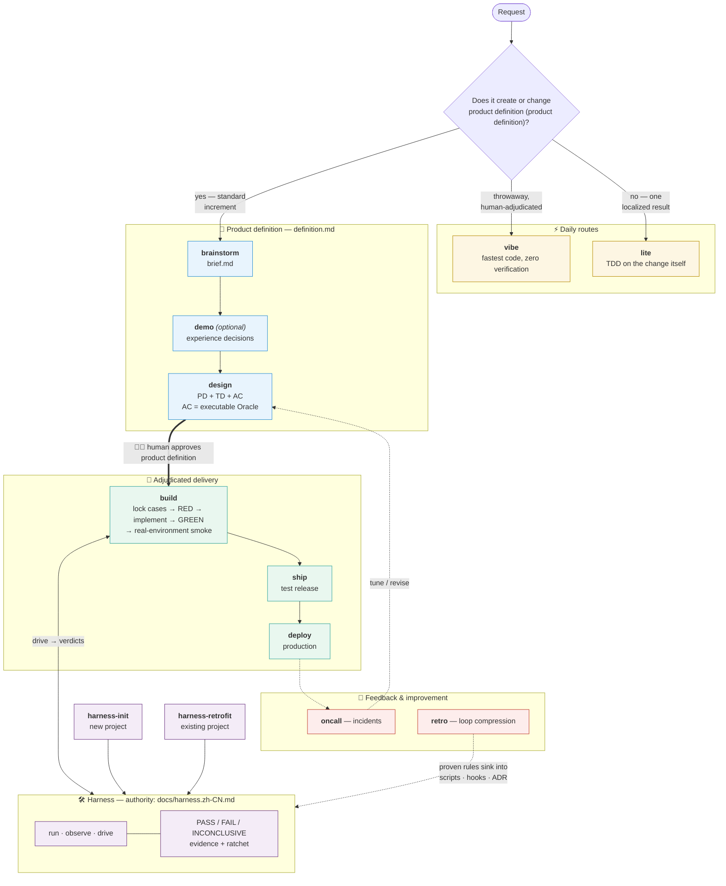
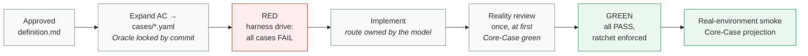

# opc-develop

[简体中文](README.zh-CN.md)

opc-develop is a product-development skill suite for Claude Code and Codex. It is not one heavy
pipeline for every edit. It is a set of routes: use `lite` for a daily change that does not touch
product definition; use `design -> build` for a standard or releasable product increment; use `vibe`
when a human explicitly wants unverified speed; and enter separate safety flows for release and
incidents.

Its core promise is: **make the human approve the product definition before implementation, then
let the project Harness — not the agent — adjudicate the result with independent evidence.** The
human owns product judgment, design taste, and irreversible technical decisions. The agent
implements and is judged inside those boundaries.

> Version 0.7 rebuilds the suite for Fable-5-class models. The demo → prd → testcase → architect
> chain is retired; product decisions collapse into one definition document; verification moves from
> agent-graded checklists to harness adjudication.

## The 0.7 rebuild: what changed and why

This release is a subtraction pass. Its essence, in six ideas:

1. **Process weight was a compensation for weak models.** Step-by-step ceremony, self-graded
   checklists, and approval-json chains existed to keep an unreliable implementer honest.
   Frontier models need the opposite: crisp boundaries, locked oracles, and an independent judge —
   then freedom of route. Everything that only supervised the *how* was deleted.
2. **SPEC is a side effect; only decisions are truth.** PRD, technical design, and E2E testcases
   were three renderings of one batch of decisions. They collapse into a single product definition
   (`definition.md`): **PD** product bottom lines, **TD** hard-to-reverse technical
   decisions, **AC** black-box acceptance criteria. Admission rule: *decisions only, never
   implementation* — anything the model can safely decide or reverse on its own stays out.
3. **AC doubles as the executable Oracle.** There is no separate testcase artifact to draft,
   compile, review, and approve. Each AC expands mechanically into a machine-readable case;
   locking the cases by commit before implementation separates referee from player.
4. **Trust is inverted: adjudication replaces self-report.** Completion claims no longer come
   from receipts the agent generates about itself. The project Harness drives the real entry and
   returns PASS / FAIL / INCONCLUSIVE with evidence; the ratchet guarantees a green case never
   silently turns red. INCONCLUSIVE is a harness gap, never an excuse to invent a new oracle.
5. **Process and Harness are decoupled but cooperating.** The Harness has its own authority
   document ([docs/harness.zh-CN.md](docs/harness.zh-CN.md)); `harness-init` and
   `harness-retrofit` are the process's hands reaching into it. Architecture inception —
   panorama diagram, domain maps, founding ADRs — lives there, with the architect deciding.
6. **Construction is pull-driven.** No capability, document, or mock layer is built ahead of a
   real need. Whatever the next feature does not use, this round does not build.

## Who it is for

opc-develop is for people who personally own product and engineering judgment: OPC (one-person
company) founders, solo builders, small product teams, and close PM + architect/builder pairs. You
must be able to judge whether the user value is real, the interaction feels right, and the
architecture is worth carrying. The suite protects and executes those judgments; it does not
pretend to replace taste.

It is a strong fit when you want to:

- make an agent prove a user result from the real entry instead of merely writing code;
- keep daily changes light, product increments evidence-backed, and production fail-closed;
- concentrate human time at judgment points (product definition approval, ADRs, acceptance) instead of process
  supervision;
- adopt around existing tools and runbooks rather than replacing the engineering system.

It is not designed to outsource all product judgment to an agent, or for work dominated by
cross-team roadmaps, organizational approvals, and resource negotiation. Without a human owner for
product and architecture direction, more gates create ceremony rather than leverage.

## System architecture


```mermaid
flowchart TB
    REQ(["Request"]) --> ROUTE{"Does it create or change<br/>product definition (product definition)?"}
    ROUTE -->|"throwaway,<br/>human-adjudicated"| VIBE
    ROUTE -->|"no — one<br/>localized result"| LITE
    ROUTE -->|"yes — standard<br/>increment"| BS

    subgraph DAILY["⚡ Daily routes"]
        VIBE["<b>vibe</b><br/>fastest code, zero verification"]
        LITE["<b>lite</b><br/>TDD on the change itself"]
    end

    subgraph DEF["📐 Product definition — definition.md"]
        BS["<b>brainstorm</b><br/>brief.md"] --> DEMO["<b>demo</b> <i>(optional)</i><br/>experience decisions"]
        DEMO --> DESIGN["<b>design</b><br/>PD + TD + AC<br/>AC = executable Oracle"]
    end

    DESIGN ==>|"🧑‍⚖️ human approves product definition"| BUILD

    subgraph DELIVER["🔨 Adjudicated delivery"]
        BUILD["<b>build</b><br/>lock cases → RED → implement → GREEN<br/>→ real-environment smoke"] --> SHIP["<b>ship</b><br/>test release"]
        SHIP --> DEPLOY["<b>deploy</b><br/>production"]
    end

    subgraph HARNESS["🛠 Harness — authority: docs/harness.zh-CN.md"]
        VERBS["run · observe · drive"] --- VERDICT["PASS / FAIL / INCONCLUSIVE<br/>evidence + ratchet"]
    end

    BUILD <-->|"drive → verdicts"| HARNESS
    HINIT["<b>harness-init</b><br/>new project"] --> HARNESS
    HRETRO["<b>harness-retrofit</b><br/>existing project"] --> HARNESS

    subgraph LOOP["🔁 Feedback & improvement"]
        ONCALL["<b>oncall</b> — incidents"]
        RETRO["<b>retro</b> — loop compression"]
    end
    DEPLOY -.-> ONCALL
    ONCALL -.->|"tune / revise"| DESIGN
    RETRO -.->|"proven rules sink into<br/>scripts · hooks · ADR"| HARNESS

    classDef daily fill:#fdf6e3,stroke:#b58900,color:#333
    classDef truth fill:#e8f4fd,stroke:#268bd2,color:#333
    classDef deliver fill:#e9f7ef,stroke:#2aa198,color:#333
    classDef harness fill:#f4ecf7,stroke:#6c3483,color:#333
    classDef loop fill:#fdedec,stroke:#c0392b,color:#333
    class VIBE,LITE daily
    class BS,DEMO,DESIGN truth
    class BUILD,SHIP,DEPLOY deliver
    class VERBS,VERDICT,HINIT,HRETRO harness
    class ONCALL,RETRO loop
```

Read the map in four layers:

1. The **routing layer** asks one question — does this change product definition? — and never routes by
   predicted duration.
2. The **truth layer** produces exactly one durable artifact per increment: an approved `definition.md`.
3. The **delivery layer** implements against locked cases and is adjudicated by the **Harness
   layer**, which owns `run` / `observe` / `drive` and returns verdicts with evidence.
4. The **feedback layer** routes anomalies (`oncall`) and loop improvements (`retro`) back to the
   earliest broken layer; proven rules sink downward into scripts, hooks, and ADRs.

## Five-minute quick start

### 1. Install

Codex:

```bash
codex plugin marketplace add wallkop/opc-develop --ref main
codex plugin add opc-develop@opc-develop
```

Claude Code from a local clone:

```bash
git clone https://github.com/wallkop/opc-develop.git ~/plugins/opc-develop
claude --plugin-dir ~/plugins/opc-develop
```

See [docs/claude-code.md](docs/claude-code.md) for Claude Marketplace setup. Start a new Codex or
Claude Code session after installing or updating so the new skill definitions enter context.

### 2. Invoke a skill explicitly

Codex uses `$opc-develop:<skill>`; Claude Code uses `/opc-develop:<skill>`. Natural-language
triggering also works, but explicit invocation is easier for onboarding and high-stakes tasks.

```text
# Codex: a daily small change
$opc-develop:lite Fix duplicate submission on the settings save button. Change only this issue.

# Codex: a standard product increment
$opc-develop:design Grill me and produce definition.md (PD/TD/AC) for "a user can export this month's invoice".
$opc-develop:build Implement the approved product definition; adjudicate every case through harness drive.

# Codex: bootstrap or retrofit the workbench
$opc-develop:harness-init Guide me through initializing the Harness for this new project.
$opc-develop:harness-retrofit Inventory this repo, show me the gap table, then migrate step by step.
```

In Claude Code, replace `$` with `/`:

```text
/opc-develop:lite Fix duplicate submission on the settings save button. Change only this issue.
/opc-develop:design Produce and lock the product definition for the export flow.
/opc-develop:build Implement the approved product definition with harness-adjudicated evidence.
```

### 3. Route by semantics and risk

Ask two questions first: **does this create or change product definition, and must it enter a
test/production release?** Never route or block work using a predicted duration.

| Route | Use when | What it does | What it does not do |
| --- | --- | --- | --- |
| `vibe` | You explicitly want the fastest code and will accept it yourself | Edits immediately and hands over the diff with a no-verification disclosure | No tests, runtime check, or evidence; cannot claim releasable |
| `lite` | One localized result; PD/TD/AC semantics untouched | TDD against the change itself, ratchet regression, honest evidence | If scope looks like it touches product definition, it reminds once — and never silently rewrites a locked Oracle |
| `design` → `build` | New/changed product behavior or release-bound work | One product definition pass (PD/TD/AC), human approval, then harness-adjudicated implementation | `build` cannot invent or change the Oracle during implementation |
| decompose | Several independently useful outcomes | Separates journeys for clarity and independent proof | Never uses an effort estimate as a stop gate |

### 4. Product definition is mandatory; architecture lives inside `design`

| Unresolved question | Use first | Skip it when |
| --- | --- | --- |
| Product value, user, non-goals, or core behavior is unclear | `brainstorm` | You can already state the user action, visible result, and non-goals in `brief.md` |
| What the experience should be | `demo` | Non-UI work uses a runnable skeleton; experience is already decided |
| What must stay true, which technical choices are hard to reverse, and what exact black-box experiment proves it | `design` | Never for a standard increment — PD, TD, and AC are settled in this one pass |

The standard path is `design -> build`, with `brainstorm` and `demo` in front when intent or
experience is unsettled. TD's first entry is always the architecture position diagram cut from the
project panorama; a new node or edge there forces an ADR and a panorama update — that is the
architecture gate, no separate `architect` phase required. `lite` stays small only while it reuses
existing semantics.

## Which skill does what

### Daily delivery

| Skill | Typical use | Primary result | Next |
| --- | --- | --- | --- |
| `vibe` | Disposable experiment; explicitly human-accepted unverified code | Code diff plus a no-verification disclosure | Human review; rerun through `build` before release |
| `lite` | Bug, copy/layout, config, minor behavior with product definition untouched | RED-first fix, ratchet regression, before/after evidence | Done; route definition-touching scope to `design` |
| `build` | Approved product definition ready for implementation | Locked cases, RED → GREEN drive verdicts, one reality review, real-environment smoke | `ship` after all cases PASS |

### Product definition

| Skill | Typical use | Primary result | Next |
| --- | --- | --- | --- |
| `brainstorm` | Raw idea needs one-question-at-a-time grilling | `brief.md`, risk profile, non-goals | `demo` or `design` |
| `demo` | Make the experience concrete before locking truth | Prototype in the real app shell, experience decision list | `design` |
| `design` | Turn brief + demo decisions into durable truth | Approved `definition.md` (PD/TD/AC, architecture position diagram, Core-Case), ADRs when architecture moves | `build` |

### Workbench

| Skill | Typical use | Primary result | Next |
| --- | --- | --- | --- |
| `harness-init` | New project needs a runnable, observable, driveable workbench | Guided rounds of architect-confirmed decisions; environment proven by lit verification cases; founding ADRs and panorama | `brainstorm` / `design` |
| `harness-retrofit` | Existing project; agents rediscover commands, fake parity, no drive | Inventory → gap table → pull-driven migration, verification cases lit step by step | Return to delivery |

### Release, incidents, and loop improvement

| Skill | Typical use | Primary result | Next |
| --- | --- | --- | --- |
| `ship` | `build` finished with fresh green verdicts | Test deploy, Core-Case smoke projection, human acceptance, trunk merge | Human chooses whether to `deploy` |
| `deploy` | Human-accepted increments are merged and ready for production | Fail-closed preflight, backup/rollback, prod-safe smoke, watch | Close or route anomalies to `oncall` |
| `oncall` | Something is wrong on test or production | Severity triage, evidence chain, rollback/hotfix/mitigation, error-ledger entry | Re-enter through `lite`, `design`, or `build` for the long-term fix |
| `retro` | Several increments/incidents exist and the loop needs improvement | Cost/recurrence report, benchmark evidence, rule/pruning proposals | Human approves changes at the lowest useful layer |

## Recommended combinations by scenario

| Request | Recommended route | Why |
| --- | --- | --- |
| Change one label or fix one local bug | `lite` | One result does not justify truth artifacts |
| A hotfix must ship today | `lite` or `build` → `ship` → `deploy` | Release requires harness-adjudicated evidence regardless of duration |
| Add a clear export flow | `design` → `build` | Even clear intent needs an approved Oracle before implementation |
| "Build an AI study coach," but user/value is unclear | `brainstorm` → `demo` → `design` → `build` | Resolve intent, experience, and truth in order |
| A new checkout interaction is not decided | `demo` → `design` → `build` | Approve the experience before locking its Oracle |
| New permission model plus a public API | `design` (TD + ADR) → `build` | Hard-to-reverse boundaries are TD entries with ADRs, not a separate phase |
| One request contains admin, mobile, and operations journeys | split → first `design` → `build` | Independently useful journeys should not share one increment |
| Production error rate spikes | `oncall` | Diagnose and stabilize with evidence before guessing a fix |
| Every agent rediscovers start commands and test data | `harness-retrofit` | The problem is the engineering workbench, not a feature |
| Brand-new empty repository | `harness-init` → `brainstorm` → `design` → `build` | Make the system runnable and adjudicable before the first feature |

## Best practices

1. **Start from the user action.** State who enters where, performs what action, and sees what
   result. Avoid an internal task name such as "finish the export module."
2. **Route by semantics and risk, never predicted duration.** Localized changes that leave product definition
   untouched may use `lite`; new behavior and releasable increments settle truth in `design`
   before `build`.
3. **Protect one Core-Case per increment.** Every product definition names exactly one F0 positive main journey
   and its test/production smoke projection; decompose independently useful journeys.
4. **One truth, three dimensions.** `definition.md` holds decisions only — PD bottom lines, TD
   irreversible choices, AC black-box criteria. Anything the model can safely reverse stays out.
5. **Separate referee from player.** Expand AC into machine-readable cases and lock them by
   commit *before* implementation; changing the Oracle voids every green light and requires a
   stated reason.
6. **RED before implement.** All cases must fail meaningfully first. INCONCLUSIVE means the
   harness cannot reach or observe — fix the harness; never invent a bedside oracle.
7. **Never use a real provider as the debug loop.** Stabilize local and replay paths first; the
   one real call lands inside the real-environment smoke, not inside iteration.
8. **Route feedback to the earliest broken layer.** `tune` changes execution under the same
   truth; `revise` corrects the product definition and voids downstream verdicts; `park` closes the line cleanly.
9. **Claim completion from verdicts, not test counts.** Green never migrates across
   environments: local all-PASS still requires the Core-Case smoke projection in the real
   environment.
10. **Run `retro` after evidence exists.** A practical first cadence is after 3-5 standard
    increments or one high-value incident; proven rules sink into scripts, hooks, and ADRs.

## Solo builder and PM handoff

A **solo builder** still approves product definition explicitly. For a standard increment, answer the
`design` grilling honestly, read the rendered `definition.md`, approve it, then let `build` run. `lite`
avoids the chain only while it reuses existing semantics.

A **PM + architect/builder pair** can hand off at the judgment boundary:

1. The product owner approves demo decisions and reviews each PD and AC — object, action,
   success/failure oracle, data provenance.
2. The architect owns TD: the architecture position diagram, ADRs, and the panorama update when a
   boundary moves.
3. The builder expands AC into locked cases and implements; the route (slices, order,
   parallelism) is entirely the builder's and the model's.
4. Nobody silently answers missing product judgment. Questions return as `revise` to the earliest
   owning layer.
5. `ship` test acceptance is the shared touchpoint where both roles see the real result again.

## New-project onboarding

A new project does not need a complete documentation system first. The first goal is to make the
system runnable, observable, and driveable by an agent — and to make founding architecture
decisions with the architect, not for them.

### Day 0: initialize the Harness

```text
$opc-develop:harness-init Guide me through initializing the Harness for this project.
```

`harness-init` runs guided question rounds (stack, operations surface, isomorphic infrastructure,
doc minimum set + founding decisions, adjudication surface), records hard-to-reverse choices as
founding ADRs, and refuses to declare completion until the environment verification cases are all
lit: full-stack start with health checks, one trace-id chain observed end to end, migrations from
empty, one seed case through clone → verdict → destroy, destructive-protection hard checks.

### First feature: deliver one journey

- Clear intent: `design`, then `build`.
- Unclear product intent: `brainstorm` (and `demo` when the experience is unsettled) first.
- Non-UI feature: demo supplies a runnable production-shaped skeleton before design.

### First release

Use `ship` after a test-environment runbook exists. Enter `deploy` only after test acceptance and
the trunk merge. Production requires rollback, backups, and a watch window; a missing runbook stops
the flow instead of inviting improvised release mechanics.

### Steady-state cadence

- daily small change: `lite`;
- product increment: `design` → `build`;
- test acceptance: `ship`; production: `deploy`;
- after 3-5 increments: `retro`;
- whenever delivery exposes run/observe/drive gaps: `harness-retrofit`.

## Existing-project adoption

Adopt gradually. **Do not big-bang migrate** existing documentation, CI, tests, or release systems.

### Step 1: inventory before rebuilding

```text
$opc-develop:harness-retrofit Inventory this repo first. Show me the gap table before changing anything.
```

`harness-retrofit` inspects the code before asking anything a repo can answer, then produces a
gap table (current state → harness requirement → gap → risk) and confirms migration decisions
with the architect. Keep the existing Makefile, npm scripts, Docker Compose, test framework, CI,
and runbooks; the retrofit wraps stable entries around them and only adds what is missing —
ordered by feedback-loop value: operations shell first, structured logs and trace-id next, then
killing fake parity (SQLite standing in for MySQL, in-memory mocks for object storage), then
protected resources and the first real-entry drive case, then the doc catch-up with as-built ADRs.

### Step 2: start with real daily `lite` work

Choose a real small change from the current week. Confirm that opc-develop preserves scope, runs a
targeted ratchet regression, checks the real entry, and labels evidence honestly.

### Step 3: pilot one low-risk `design -> build`

Choose one clear, reversible core journey. Pilot the full chain and judge whether product definition review, the
locked Oracle, and harness verdicts reduce false green for you. Do not backfill every historical
feature; apply the chain to new or semantically changed behavior.

### Step 4: adopt release separately

Existing test/production runbooks can remain the execution source for `ship` and `deploy`. Pilot
test deployment on one low-risk increment before deciding whether production enters the suite.
Do not enable `deploy` without an explicit runbook and rollback capability.

### Compatibility rules

- Existing requirement/PRD/technical artifacts remain source material; a new increment still
  settles truth in a fresh `definition.md`.
- Existing E2E tests may sit behind the project harness once mapped to approved cases; raw tests
  are not automatically product definition.
- Do not backfill history, replace existing tests, or install project hooks in one batch. CI/hook
  enforcement is an explicit human decision.

## What `build` actually does


```mermaid
flowchart LR
  A["Approved<br/>definition.md"] --> B["Expand AC →<br/>cases/*.yaml<br/><i>Oracle locked by commit</i>"]
  B --> C["RED<br/>harness drive:<br/>all cases FAIL"]
  C --> D["Implement<br/><i>route owned by the model</i>"]
  D --> E["Reality review<br/><i>once, at first<br/>Core-Case green</i>"]
  E --> F["GREEN<br/>all PASS,<br/>ratchet enforced"]
  F --> G["Real-environment smoke<br/>Core-Case projection"]

  classDef red fill:#fdedec,stroke:#c0392b,color:#333
  classDef green fill:#e9f7ef,stroke:#229954,color:#333
  classDef neutral fill:#f8f9f9,stroke:#7f8c8d,color:#333
  class C red
  class F,G green
  class A,B,D,E neutral
```

The contract is the product definition, the judge is the Harness, the route belongs to the model. `build` expands
approved AC into machine-readable cases and locks them, proves the RED baseline, implements
through production assembly (white-box tests ride with the code by TD risk), takes exactly one
cold-context reality review at first Core-Case green, then drives everything to PASS under the
ratchet. Completion is all-PASS plus the four adjudication artifacts, followed by the mandatory
Core-Case smoke projection in the real environment — green never migrates across environments.

FAIL cases are the re-entry points. Human rejection is classified `tune` (implementation defect,
back to implement) or `revise` (the product definition itself is wrong, back to `design`, downstream verdicts
voided). There is no feature-plan, no acceptance document, no ledger — Git history and run records
carry the process state.

## Release and incident boundaries

- `ship` owns test only: precheck, manifest, deploy, Core-Case smoke projection, human
  acceptance, and trunk merge.
- `deploy` owns production: fix the release set, backup and rollback, deploy, prod-safe smoke,
  and watch. Every destructive step needs human approval.
- `oncall` triages and diagnoses first. The human chooses rollback, hotfix, or mitigation. A
  release-bound hotfix still routes through adjudicated delivery; expedited does not mean
  unverified.

## Repository and project artifacts

Plugin repository:

- `skills/`: the 12 user entry points;
- `docs/harness.zh-CN.md`: the Harness authority document (operations surface, isomorphic
  infrastructure, doc system, adjudication surface, exploration surface, inception decisions,
  pull-driven construction);
- `shared/core-contract.md`: semantic routing, evidence, completion, feedback, and safety
  invariants;
- `shared/packs/`, `shared/formats/`, `shared/rubrics/`, `shared/prompts/`, `agents/`:
  on-demand rules, formats, review checklists, and reviewer roles;
- `shared/scripts/`: benchmark/retro tooling and legacy v0.6 validators kept for compatibility —
  none of them gate delivery anymore; adjudication belongs to the project Harness.

Generated artifacts live in the target project — `brief.md`, `definition.md`, and `cases/` under the
project's feature directory, ADRs and the panorama under its architecture docs — never in this
plugin repository.

## Update

Codex Marketplace install:

```bash
codex plugin marketplace upgrade opc-develop
codex plugin add opc-develop@opc-develop
```

Local clone:

```bash
cd ~/plugins/opc-develop
git pull --ff-only
```

Start a new session after updating.

## Development and validation

```bash
python3 shared/scripts/test_opc_scripts.py
python3 shared/scripts/opc_benchmark.py validate shared/fixtures/opc-benchmark/registry.json
```

## Safety and language

Applicable project `AGENTS.md` language rules govern conversation, artifacts, reviews, and reports;
parser-required keys, tokens, IDs, and commands keep their fixed spelling. The plugin repository
must never contain business data, credentials, private logs, `.env` files, or generated project
artifacts.

Destructive actions, production mutations, permission/security changes, irreversible schema/data
work, force pushes, and external publication always require explicit human approval.

## License

MIT
