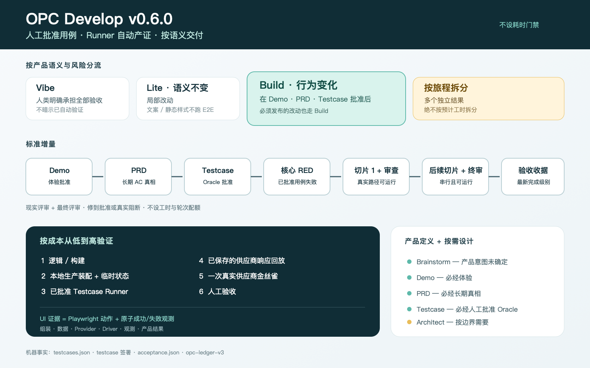

# opc-develop

[English](README.md)

opc-develop 是一套面向 Claude Code / Codex 的产品开发 skill。它不是要求每次改字都跑重流程：
不改变 E2E 产品语义的小改用 `lite`；标准或可发布增量必须走
`demo → prd → testcase → build`；只有公共/单向技术边界变化时才增加 `architect`。

它的核心承诺是：**实现前先让人批准黑盒测试语义，再用 runner 自动产出的版本绑定证据证明
这条旅程。**
人类继续负责产品判断、设计品味和架构方向；agent 负责在明确边界内实现、验证并留下可复核证据。

> 0.6 把 testcase 从 PRD 中独立出来，并把 demo、PRD、testcase 设为 build 的必经前置。
> Playwright 只负责驱动已批准的用例，不再负责临场发明测试语义。

## 适合谁

opc-develop 主要为亲自承担产品与工程判断的人设计：OPC（一人公司）创始人、独立 Builder、
小型产品团队，以及由 PM 与架构师/Builder 组成的紧密搭档。你需要能判断“用户价值是否成立、
交互是否对、架构是否值得长期承担”；skill 帮你保护和执行这些判断，不替你假装拥有品味。

它尤其适合以下情况：

- 想让 agent 不只是写代码，还能从真实入口证明用户结果；
- 希望日常小改轻量、产品增量有证据、生产发布默认谨慎；
- 想看见命令、评审、Provider、返工和故障的真实成本，并逐步裁剪流程；
- 团队已有工具和 runbook，希望渐进接入，而不是换掉整套工程系统。

它不适合把所有产品判断外包给 agent，也不擅长主要难点是跨团队路线图、组织审批和资源谈判的
工作。没有人对产品和架构方向负责时，更多门禁只会制造形式感。

## 全景架构


从上到下读这张图：

1. **Harness 层**让 agent 真正具备 `run`、`reset`、`observe`、`drive` 四种可执行能力。
2. **交付层**按范围选择 `vibe`、`lite`，或标准链
   `demo → prd → testcase → build`；`brainstorm` 可放在 demo 前，`architect` 按需放在
   testcase 后；之后由 `ship` 和 `deploy` 进入测试与生产。
3. **反馈层**把人类意见分为 `tune`、`revise`、`park`，在最早出错的层修复，而不是一直在
   代码末端打补丁。
4. **度量层**由 feature 账本、验收收据、错误账本和 `retro` 组成，把高价值失败压成
   Benchmark，并把有效规则下沉到脚本、hook 或结构化工件。

右侧的 `oncall` 处理线上故障；`harness` 补齐被交付过程暴露出来的运行能力缺口。

## 5 分钟上手

### 1. 安装

Codex：

```bash
codex plugin marketplace add wallkop/opc-develop --ref main
codex plugin add opc-develop@opc-develop
```

Claude Code 本地加载：

```bash
git clone https://github.com/wallkop/opc-develop.git ~/plugins/opc-develop
claude --plugin-dir ~/plugins/opc-develop
```

Claude Marketplace 的完整配置见 [docs/claude-code.md](docs/claude-code.md)。安装或更新后，
请新开一个 Codex / Claude Code 会话，让新的 skill 定义进入上下文。

### 2. 明确调用方式

Codex 使用 `$opc-develop:<skill>`；Claude Code 使用 `/opc-develop:<skill>`。自然语言也可以
触发 skill，但新人和关键任务建议显式指定，避免选路含糊。

```text
# Codex：日常小改
$opc-develop:lite 修复设置页保存按钮的重复提交，只改这个问题。

# Codex：标准产品增量
$opc-develop:demo 在真实应用壳中做出“用户导出本月账单”的可体验原型。
$opc-develop:prd 基于已批准 demo 固化 AC 产品真相。
$opc-develop:testcase 把黑盒用例展示给我审阅并编译成可执行清单。
$opc-develop:build 实现已批准的 Core-Case，并由 runner 自动产证。

# Codex：先评估项目工作台能力
$opc-develop:harness 评估这个项目的 run/reset/observe/drive，只给证据和前三个缺口。
```

Claude Code 中把 `$` 调用改为 `/`：

```text
/opc-develop:lite 修复设置页保存按钮的重复提交，只改这个问题。
/opc-develop:testcase 在 demo 和 PRD 批准后编译并签署黑盒用例。
/opc-develop:build 实现已批准的 Core-Case，并由 runner 自动产证。
```

### 3. 按语义和风险选路

先问两个问题：**它是否新增或改变产品 E2E 语义？它是否需要进入测试/生产发布？**
禁止用预计耗时给需求选路、阻断开发或强制拆分。

| 路径 | 什么时候用 | 会做什么 | 不会做什么 |
| --- | --- | --- | --- |
| `vibe` | 你明确只要最快代码，并亲自验收 | 直接修改，交给人看 diff | 不测试、不运行、不生成证据，不能声称可发布 |
| `lite` | 局部改动，且不新增或改变 E2E 语义 | 按比例做定向检查和轻量真实入口证据 | 纯文案、静态样式、文档默认不跑 E2E |
| `build` | 新增/改变产品行为，或必须发布的改动 | 已批准 Core-Case、可运行切片、评审、新鲜收据 | 实现时不能临场发明或改写 E2E 语义 |
| 按旅程拆分 | 包含多个可独立使用的结果 | 为清晰度和独立验收拆开旅程 | 不以预计工时作为停止门禁 |



这张图只是**选路图和单次增量流程**，不是全景架构图。

### 4. 产品定义必经，架构仍按需

| 仍然不确定的事情 | 先用哪个 skill | 何时可以跳过 |
| --- | --- | --- |
| 产品价值、用户、非目标或核心行为还说不清 | `brainstorm` | 已经能清楚写出用户动作、可见结果和非目标 |
| 体验应该是什么样 | `demo` | build 不可跳过；非 UI 用可运行 skeleton |
| 哪些长期行为必须成立 | `prd` | build 不可跳过；必须基于已批准 demo |
| 用什么外部实验证明 | `testcase` | build/E2E 不可跳过；必须同时具备 demo + PRD |
| 公共 API/事件/schema 边界或单向技术决定发生变化 | `architect` | 实现沿用现有架构，决定可逆且局部 |

标准路径是 `demo → prd → testcase → build`；`brainstorm` 可选放在最前，`architect` 只在
公共/单向边界变化时插入。`lite` 只有在复用既有语义且不产生新 E2E/发布声明时保持轻量。

## 哪个 skill 在什么场景做什么

### 日常交付

| Skill | 典型场景 | 主要结果 | 下一步 |
| --- | --- | --- | --- |
| `vibe` | 一次性实验、你明确接受未验证代码 | 代码 diff + “未运行测试”说明 | 人工检查；若要发布，重新走 `build` |
| `lite` | bug、文案/布局、配置、小行为调整 | 修改、最小回归、真实入口前后对比 | 完成；若范围扩成多切片，转 `build` |
| `build` | 已批准的新行为/语义变化；发布型修复 | case 驱动实现、`feature-plan.md`、`acceptance.json`、评审记录 | 本地完成后进入 `ship` |

### 产品定义与按需架构

| Skill | 典型场景 | 主要结果 | 下一步 |
| --- | --- | --- | --- |
| `brainstorm` | 原始想法模糊，需要逐个问题拷打 | `requirement.md`、风险画像、非目标、feature 分支 | `demo` |
| `demo` | 实现前把体验具体化 | 真实应用壳中的原型、`prototype.md`、`mock-inventory.md` | `prd` |
| `prd` | 把已批准 demo 固化为长期产品真相 | `prd.md`、编号 AC/PD、demo alignment | `testcase` |
| `testcase` | 把黑盒 oracle 变成人可审、机器可执行的契约 | `testcases.md/json`、独立评审、产品签署 | 按需 `architect`，否则 `build` |
| `architect` | 公共边界、不可逆技术选择、跨角色架构交接 | intake、风险 spike、`technical.md`、编号 TD、签署报告 | `build` |

### 发布、故障和改进

| Skill | 典型场景 | 主要结果 | 下一步 |
| --- | --- | --- | --- |
| `ship` | `build` 已达到新鲜的真实服务核心旅程 | 测试环境部署、同一核心旅程回归、人工验收、合并主干 | 人类选择是否 `deploy` |
| `deploy` | 已人工验收并合入主干，需要生产发布 | fail-closed 预检、备份/回滚、生产回归、观察窗口、MD/HTML 交接 | 稳定后关闭；异常转 `oncall` |
| `oncall` | 测试或生产出故障 | 严重度分诊、证据链、诊断报告、回滚/热修/缓解、错误账本 | 长期修复按 `lite` / `build` / 决策 skill 重新进入 |
| `harness` | agent 无法稳定启动、清状态、追踪请求或执行 E2E | 四动词评分、可执行脚本/seed/日志约定、薄 `AGENTS.md` 索引 | 关闭最高杠杆缺口后回到交付 |
| `retro` | 已积累多次增量/故障，想减少返工和流程成本 | 成本与复发报告、Benchmark 证据、待批准规则/裁剪建议 | 人工批准后在最低层执行 |

## 常见需求的推荐组合

| 需求 | 推荐组合 | 原因 |
| --- | --- | --- |
| 改一个按钮文案或修一个局部 bug | `lite` | 单一结果，不值得创建 feature 工件 |
| 热修必须当天发布 | `build` → `ship` → `deploy` | 无论耗时，发布都需要版本绑定的证据 |
| 新增一个边界清楚的导出功能 | `demo` → `prd` → `testcase` → `build` | 即使意图清楚，E2E 前也要让人看见 oracle |
| “做一个 AI 学习教练”，用户和价值还不清 | `brainstorm` → `demo` → `prd` → `testcase` → `build` | 依次解决意图、体验、真相和证明 |
| 新结算页的交互还没定 | `demo` → `prd` → `testcase` → `build` | 先批准体验，再编码其测试语义 |
| 新权限模型 + 公共 API | `demo` → `prd` → `testcase` → `architect` → `build` | 产品 oracle 在按需架构设计之前确定 |
| 一个需求包含后台、移动端、运营台三个独立结果 | 拆分 → 第一个 `build` | 多个可独立交付旅程不能塞进一次增量 |
| 线上错误率突然上升 | `oncall` | 先证据化诊断和稳定系统，不直接猜修复 |
| agent 每次都在猜启动命令和测试数据 | `harness` | 问题是工作台能力，不是 feature 实现 |

## 最佳实践

1. **从用户动作写起。** 请求里说清“谁从哪个真实入口做什么，看到什么结果”，不要只给
   “做完某模块”这种内部任务名。
2. **按语义和风险选路，禁止按预计耗时选路。** 复用已有 oracle 的局部改动可用 `lite`；
   新行为和可发布增量必须先走 demo、PRD、testcase。纯文案、静态外观、文档默认不跑 E2E。
3. **一个增量保护一条核心旅程。** 多条可独立使用的旅程可为清晰度拆分；第一片穿过
   正式 router/service/页面组装，后续切片保持前一片可运行。
4. **分开四种真相。** `demo` 负责体验，`prd` 负责长期产品真相，`testcase` 负责经人批准的
   黑盒实验，`architect` 负责公共/单向技术边界。
5. **验证从便宜到昂贵。** 逻辑/build → 本地正式服务 + scratch 状态 → UI 浏览器核心旅程 →
   Provider 离线回放 → 一次真实 canary → 人工验收。
6. **UI 必须由项目 testcase runner 执行关键动作。** runner 预先监听成功/失败信号，以
   Playwright 为主驱动并自动产证；裸 Playwright 命令不是准出门禁。
7. **不要拿真实 Provider 当调试循环。** 先稳定本地与离线回放，同一版本默认只做一次真实调用。
8. **把反馈路由到最早错误层。** `tune` 是同一意图的执行调整；`revise` 是上游事实错了并使
   下游证据失效；`park` 是干净停止。
9. **以收据状态而不是测试数量宣称完成。** 代码、测试、结果卡、seed 或配置改变后，旧命令
   结论会自动变旧。
10. **有数据再跑 `retro`。** 建议先积累 3～5 个标准增量或一次高价值故障；没有采集数据时，
    `retro` 应报告缺口，而不是编造效率结论。

## 独立 Builder 和 PM 搭档怎么用

**独立 Builder** 也必须显式批准产品语义。标准增量由自己走完 demo/PRD/testcase、审阅报告，
再进入 build；只有复用既有语义且不做 E2E/发布声明的小改才直接用 `lite`。

**PM + 架构师/Builder** 可以沿判断边界交接：

1. 产品负责人批准 demo，用 PRD 固化 PD/AC，再逐条审查 testcase 的对象、动作、成功/失败
   oracle 和数据来源；
2. `testcase` 编译 `testcases.json`，完成独立评审和产品签署，再提交推送 feature 分支；
3. Builder 拉取并检查 testcase 链；只有公共边界或单向技术决定变化时运行 `architect`，
   否则进入 `build`；
4. Builder 不替产品负责人静默回答缺失的产品判断，问题以 `revise` 返回最早责任层；
5. `ship` 的测试环境验收是双方重新看见真实结果的共同触点。

## 新项目怎么落地

新项目不需要先建立完整文档体系。第一目标是让 agent 能稳定地运行、清状态、观察和驱动系统。

### 第 0 天：建立最小 Harness

在仓库的新会话中执行：

```text
$opc-develop:harness 初始化这个新项目的最小 Harness。先补 run 和 reset，再建立一个具名 seed，
然后证明一次 observe 链和一条 drive 旅程；AGENTS.md 只做命令索引，不堆说明。
```

最小可用标准：

- 一条命令启动目标栈并能检查健康状态；
- 一条幂等 reset 命令和至少一个具名 seed；
- 一次用户动作可以通过 correlation ID 串起日志，并能只读检查状态；
- 至少一条从真实入口执行的 Tier-1 核心旅程；
- 凭据、生产数据和 `.env` 不进入仓库。

空仓库也可以从 `run` / `reset` 开始；opc-develop 不替你决定框架和产品方向，必要时先用
`brainstorm` 明确第一条用户价值，再走 demo/PRD/testcase 后创建第一个 build 切片。

### 第 1 个功能：只交付一条旅程

- 意图清楚：从 `demo` 开始，再走 `prd → testcase → build`。
- 产品意图不清：先 `brainstorm`，再走标准链。
- 非 UI 功能：demo 用可运行、生产形状一致的 skeleton。
- 架构文档仍只在公共/单向边界变化时增加。

### 第一次发布

准备好测试环境 runbook 后使用 `ship`；只有 `ship` 的人工验收和主干合并完成，才进入
`deploy`。生产发布必须有回滚路径、备份和观察窗口，缺任何一项都停止而不是临场发明。

### 稳定后的节奏

- 日常小改：`lite`；
- 产品增量：`build`；
- 测试验收：`ship`；
- 生产发布：`deploy`；
- 3～5 个增量后：`retro`；
- 交付暴露出 run/reset/observe/drive 缺口时：回到 `harness`。

## 老项目怎么接入

老项目应渐进接入，**不要大爆炸迁移**现有文档、CI、测试和发布系统。

### 第一步：只评估，不先重建

```text
$opc-develop:harness 只评估现有项目的 run/reset/observe/drive。实际执行已有命令，
不要先修改项目；列出证据、真实性上限和前三个最高杠杆缺口。
```

保留已有 Makefile、npm scripts、Docker Compose、测试框架、CI 和 runbook。`harness` 应把它们
组织成稳定入口，只有能力缺失时才补脚本，不另造一套平行工具。

### 第二步：从日常 `lite` 开始

选择一周内真实发生的小改，验证 opc-develop 能否：保持范围、跑定向测试、从真实入口检查
结果、诚实报告证据。此阶段不要求创建 `docs/features/`。

### 第三步：选一个低风险功能试点 `build`

选择一条清楚、可回滚的核心旅程，试点完整产品定义链并生成：

```text
docs/features/<slug>/feature-plan.md
docs/features/<slug>/testcases.md
docs/features/<slug>/testcases.json
docs/features/<slug>/testcase-approval.json
docs/features/<slug>/acceptance.json
docs/features/<slug>/ledger.jsonl
```

观察 testcase 人工审阅、首条真实纵向切片和收据新鲜度是否减少假绿；不要回填全部历史功能，
只对新功能或 E2E 语义变化应用新链路。

### 第四步：发布流程单独接入

现有测试/生产 runbook 可直接被 `ship` / `deploy` 使用。先在一个低风险增量上接入测试环境，
再决定是否让生产发布进入 opc-develop。没有明确 runbook 和回滚能力时，不要启用 `deploy`。

### 兼容原则

- 旧 requirement/demo/PRD/technical 可作为输入，但新 build 仍要形成新鲜的 demo、PRD、
  testcase 编译/评审与产品签署链。
- 旧 E2E 可在映射到已批准 testcase 后接入项目 runner；裸测试代码不会自动变成产品真相。
- 历史 v2 账本仍可读取；新标准增量使用 v3 账本与生成式 `acceptance.json`。
- 不回填历史 feature，不替换已有测试，不要求一次性安装 hook；是否把门禁接进 CI 由人明确决定。

## `build` 到底会做什么


`build` 消费已批准的 `testcases.json`，再创建 `feature-plan.md`，记录 Core-Case、真实入口、
数据来源、安全条件、切片和项目 case-runner 命令。`opc_increment.py` 根据 runner 证据推导
真实性标签，生成 `acceptance.json` 并把结论绑定到当前内容树。

完成等级只有四级：

1. `code-build`：当前版本通过构建/逻辑层；
2. `automated-core-journey`：自动化核心旅程通过；
3. `real-service-core-journey`：通过本地正式服务组装和真实入口；
4. `human-accepted`：人类对当前候选版本明确验收。

标准增量有两个代码评审点：首条纵向切片后的现实评审，以及全部范围集成后的最终评审。
持续修复并复审，直到批准，或遇到必须由用户、外部状态或重新设计解决的真实阻断；不设固定轮次。

常用机械检查：

```bash
python3 shared/scripts/validate_artifacts.py docs/features/<slug>/feature-plan.md
python3 shared/scripts/opc_testcase.py check \
  --feature-dir docs/features/<slug> --require-approved
python3 shared/scripts/opc_increment.py check \
  --receipt docs/features/<slug>/acceptance.json \
  --require real-service-core-journey
python3 shared/scripts/opc_ledger.py audit --require-increment-complete \
  --ledger docs/features/<slug>/ledger.jsonl
```

## 发布与故障边界

- `ship` 只负责测试环境：预检、变更清单、部署、同一核心旅程回归、人工验收、合并主干。
- `deploy` 只负责生产：固定 release set、在最终主干刷新收据、备份/回滚、部署、prod-safe 回归、
  观察窗口；每个破坏性步骤都需要人类确认。
- `oncall` 先分诊和证据化诊断。回滚、热修复和缓解由人选择；发布型热修仍需
  `build` → `ship` → `deploy`，加速不等于不验证。

## 仓库与项目工件

插件仓库：

- `skills/`：13 个用户入口；
- `shared/core-contract.md`：语义选路、证据、完成等级、反馈和安全底线；
- `shared/packs/`：按需加载的实现、风险、评审、发布、Harness 规则；
- `shared/formats/`：结果卡、收据、PRD、技术、测试、账本格式；
- `shared/rubrics/`：独立评审清单；
- `shared/scripts/`：标准库 Python 的结构校验、收据、账本、Benchmark 和报告工具；
- `agents/`、`shared/prompts/`：冷上下文 reviewer 与例外 implementer 角色。

项目工件永远写入目标项目的 `docs/features/<slug>/` 和 `docs/opc/`，不写回插件仓库。

## 更新

Codex Marketplace 安装：

```bash
codex plugin marketplace upgrade opc-develop
codex plugin add opc-develop@opc-develop
```

本地 clone：

```bash
cd ~/plugins/opc-develop
git pull --ff-only
```

更新后新开会话。

## 开发与验证

```bash
python3 shared/scripts/test_opc_scripts.py
python3 shared/scripts/opc_benchmark.py validate shared/fixtures/opc-benchmark/registry.json
python3 shared/scripts/opc_benchmark.py run shared/fixtures/opc-benchmark/registry.json --repo .
```

## 安全与语言

项目 `AGENTS.md` 的目标语言规则约束对话、工件、评审和报告；解析器要求的 key、token、ID
和命令保持固定拼写。插件仓库不得包含业务数据、凭据、私有日志、`.env` 或项目生成工件。

破坏性操作、生产变更、权限/安全变更、不可逆 schema/数据操作、force-push 和对外发布，
始终需要人类显式批准。

## License

MIT
