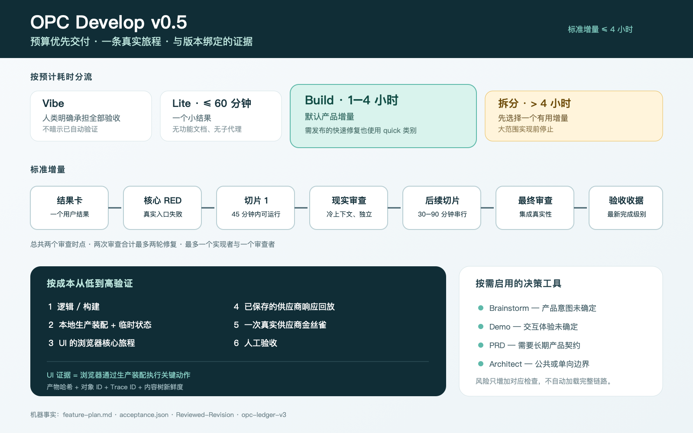

# opc-develop

[English](README.md)

opc-develop 是一套面向 Claude Code / Codex 的产品开发 skill。它现在默认解决一件更具体的
事：在明确的时间预算内，尽快跑通一条真实用户路径，再按可运行切片扩展，并让机器生成的
新鲜收据决定“到底完成到了哪一级”。

0.5 版不再默认采用“先写全量规格、拆全量合同、逐合同反复评审、最后才集成”的流程。
requirement、demo、PRD、technical 仍保留，但只在长期决定确实值得时显式使用。



## 先选最小流程

| 路径 | 适用情况 | 流程 |
| --- | --- | --- |
| `vibe` | 人类明确接受未测试代码，并亲自负责全部验收 | 立即改代码，不测试、不验证 |
| `lite` | 单一结果，可信预计不超过 60 分钟 | 直接修改、定向回归、一次真实入口检查 |
| `build` | 单一产品增量，预计 1～4 小时；或需要发布的快速修复 | 一页结果卡、一条核心旅程、可运行切片、新鲜收据 |
| 拆分 | 超过 4 小时，或包含多个可独立使用的结果 | 拆成多个标准增量，只实现第一个 |

风险只增加对应检查：迁移增加快照与回滚，权限增加允许/拒绝路径，外部 Provider 增加离线
回放和最终一次 canary。出现风险词，不再自动加载全套文档和门禁。

## 标准增量


`build` 默认只创建 `docs/features/<slug>/feature-plan.md`，其中记录：

- 用户动作、真实入口、可见成功信号和明确非目标；
- 一条经过真实 session/auth、正式 router/service 组装、scratch 状态和用户结果的核心旅程；
- 合成种子、正式数据只读副本或真实对象的数据类型及来源哈希；
- 两条绝不能破坏的安全条件；
- 不超过 45 分钟的第一切片，以及不超过 90 分钟的后续切片；
- build 与核心旅程验收命令。

UI 功能必须由浏览器执行被验收的关键动作。先通过 API 创建 Run，再用浏览器查看，只证明
API 和读路径，不证明用户能从 UI 完成动作。

## 不把昂贵验收当调试循环

验证严格按成本和稳定性递增：

1. 逻辑/build；
2. 本地正式服务 + scratch 状态；
3. UI 的浏览器核心旅程；
4. 已保存 Provider 响应的离线回放；
5. 一次真实 Provider canary；
6. 人工验收。

`shared/scripts/opc_increment.py` 自动生成 `acceptance.json`。它把命令、退出码、时间、输出、
commit、内容树指纹、真实性标签、Origin/session、scratch DB、对象 ID、trace 和截图等信息
绑定到当前代码。代码、测试、结果卡、seed 或受版本控制的配置一变，旧结论自动失效；仅把
相同内容提交成 commit 不会失效。收据使用固定的流程产物排除项、哈希链命令历史，并在每次
检查时重新计算命令日志与运行产物哈希；同一层后来失败的尝试会覆盖更早的通过结论。

完成状态只有四级：

1. `code-build`
2. `automated-core-journey`
3. `real-service-core-journey`
4. `human-accepted`

UI 未由浏览器执行关键动作并穿过正式组装，不能达到第 3 级。快照/真实数据的哈希必须与
结果卡一致。

真实 Provider 在同一版本的 build/逻辑、本地真实核心旅程、离线回放全部通过前会被锁住。
每个版本默认只允许一次 Provider 尝试；带理由的 override 只用于例外恢复，不能拿来反复调试
Harness、DOM、seed 或页面时序。

## 会停止的评审

标准增量只有两个代码评审点：第一条纵向切片后的现实检查，以及全部本次范围完成后的最终
集成检查。首轮必须一次性给出完整、按严重度排序的问题清单。

两个评审合计最多两次修复轮。仍有阻断就缩小范围或重做设计，不继续补丁。Reviewer 使用
空白上下文，只接收 rubric、结果卡、diff、收据、项目规则和命令；禁止复制完整会话。

`opc_ledger.py audit` 会拒绝额外增量 gate、超过两次总修复轮，以及携带完整会话上下文的
dispatch 记录。

## 按需使用的决定工具

以下 skill 不再隐式触发：

- `brainstorm`：产品意图确实需要决策访谈；
- `demo`：交互品味需要先做可体验原型；
- `prd`：长期产品/状态/权限决定或 PM 交接值得单独记录；
- `architect`：公共边界或单向技术决定发生变化。

显式使用时，它们仍保留 SHA 新鲜度和结构校验。`testcases.md` 现在会真正检查 level、具名
seed、Given/When/Then、AC 双向覆盖，以及 `ui-e2e` 的浏览器动作。标准 `build` 不再实现前
生成所有未来测试骨架，而是每完成一个切片补最有价值的回归。

如果存在可选 PRD/technical 记录或 demo mock 清单，结果卡必须把本次范围内的 `AC-n`/`TD-n`
约束和每个 `M-n` 退役项映射到切片与证据。最终评审会核对实现；“可选”不等于“可忽略”。

## Skills

| Skill | 用途 |
| --- | --- |
| `vibe` | 最快、未经验证的实现，由人类验收 |
| `lite` | 一个不超过 60 分钟的小改动 |
| `build` | 一个 1～4 小时、穿过真实核心旅程的标准增量 |
| `ship` | 测试环境部署、核心旅程回归、人工验收与合并 |
| `deploy` | 默认拦截的生产发布、回滚和观察窗口 |
| `oncall` | 基于证据的故障诊断、回滚/热修复/缓解 |
| `harness` | 实际执行并补齐 run/reset/observe/drive |
| `retro` | 审计成本与数据质量，验证流程改进 |
| `brainstorm` | 可选的长期产品意图访谈 |
| `demo` | 可选的真实应用壳内原型 |
| `prd` | 可选的长期产品契约与黑盒用例目录 |
| `architect` | 可选的公共边界/单向技术设计 |

## 机械门禁

所有脚本只依赖 Python 标准库。

```bash
python3 shared/scripts/validate_artifacts.py docs/features/<slug>/feature-plan.md

python3 shared/scripts/opc_increment.py init \
  --plan docs/features/<slug>/feature-plan.md \
  --receipt docs/features/<slug>/acceptance.json

python3 shared/scripts/opc_increment.py run \
  --receipt docs/features/<slug>/acceptance.json \
  --kind build --label "seeded passed" -- <build 命令>

python3 shared/scripts/opc_increment.py check \
  --receipt docs/features/<slug>/acceptance.json \
  --require real-service-core-journey

python3 shared/scripts/validate_artifacts.py docs/features/<slug>/testcases.md \
  --prd docs/features/<slug>/prd.md
python3 shared/scripts/check_gate_chain.py docs/features/<slug>
python3 shared/scripts/opc_ledger.py audit --require-increment-complete \
  --ledger docs/features/<slug>/ledger.jsonl
```

套件仍保留可执行 Benchmark、自动 wall/token cost span、基于内容 SHA 的 review 新鲜度、
自包含 HTML 报告、错误账本复发分析，以及 run/reset/observe/drive Harness 评估。

多增量生产发布会先固定 release set，再在最终合并后的同一个 trunk 上统一刷新每份收据，并
重新取得人工结论。后续合并使更早的整树证据失效是有意的，避免旧结论静默保持绿色。

## 安装

### Codex

```bash
codex plugin marketplace add wallkop/opc-develop --ref main
codex plugin add opc-develop@opc-develop
```

本地开发：

```bash
git clone https://github.com/wallkop/opc-develop.git ~/plugins/opc-develop
```

### Claude Code

```bash
claude --plugin-dir ~/plugins/opc-develop
```

通过 namespace 调用，例如 `/opc-develop:build`、`/opc-develop:lite`。Marketplace 配置见
[docs/claude-code.md](docs/claude-code.md)。

## 本地验证

```bash
python3 shared/scripts/test_opc_scripts.py
python3 shared/scripts/opc_benchmark.py validate shared/fixtures/opc-benchmark/registry.json
python3 shared/scripts/opc_benchmark.py run shared/fixtures/opc-benchmark/registry.json --repo .
```

项目 `AGENTS.md` 的目标语言规则会约束对话、产物、评审和报告；只有解析器要求的 key、token、
ID 和命令保持固定拼写。插件仓库不得包含业务数据、凭据、私有日志、`.env` 或项目生成产物。

破坏性操作、生产变更、权限/安全变更、不可逆 schema/数据操作、force-push 和对外发布，始终
需要人类显式批准。

## License

MIT
