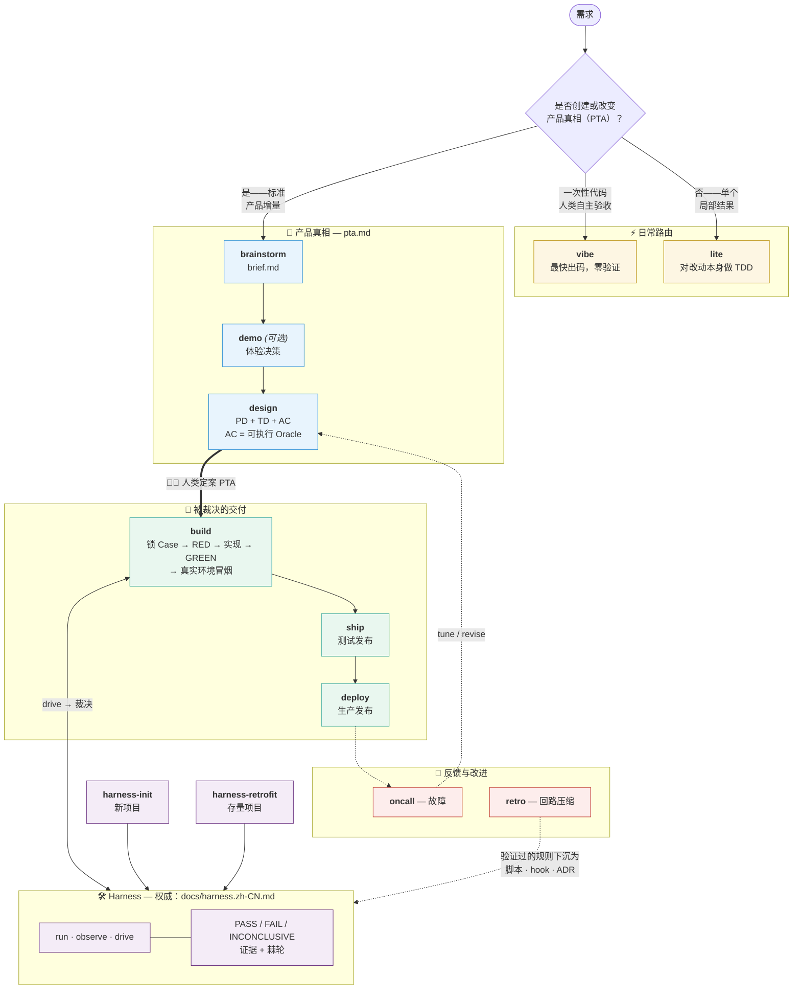
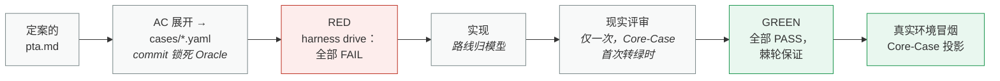

# opc-develop

[English](README.md)

opc-develop 是一套面向 Claude Code 与 Codex 的产品开发 skill 套件。它不是把每次修改都塞进同一条
重流水线，而是一组路由：日常不动产品真相的小改走 `lite`；标准 / 可发布的产品增量走
`design -> build`；人类明确要"最快出码、自己验收"时走 `vibe`；发布与故障各有独立的安全流程。

它的核心承诺是：**实现之前，让人类拍板产品真相（PTA）；实现之后，由项目 Harness——而不是
Agent 自己——用独立证据裁决结果。** 人类持有产品判断、体验品味与难以回头的技术决策；
Agent 在这些边界之内实现，并接受裁决。

> 0.7 版为 Fable-5 级模型全面重构：退役 demo → prd → testcase → architect 长链，产品真相收敛为
> 一份 PTA 文档，验证从 Agent 自评清单转为 Harness 裁决。

## 0.7 重构：改了什么，为什么

这一版是一次做减法。精髓可以浓缩为六条：

1. **流程重量本质上是对弱模型的补偿。** 步步审批、自评清单、approval-json 链条，都是为了看住
   一个不可靠的实现者。前沿模型需要的恰恰相反：清晰的边界、锁死的 Oracle、独立的裁判——
   然后把路线还给模型。凡是只用来监督"怎么做"的环节，一律删除。
2. **SPEC 是副作用，只有决策才是真相。** PRD、技术设计、E2E 测试用例本是同一批决策的三种
   渲染，现收敛为一份 PTA（Product Truth Assets）：**PD** 产品底线、**TD** 难以回头的技术
   决策、**AC** 黑盒验收标准。准入规则只有一条：*只写决策，不写实现*——模型能自行安全决定
   或推翻的内容，不进 PTA。
3. **AC 兼任可执行 Oracle。** 不再有独立的 testcase 工件去起草、编译、评审、审批；每条 AC
   机械展开为机器可读 Case，实现之前 commit 锁死——裁判与运动员分离。
4. **信任反转：裁决取代自证。** 完成结论不再来自 Agent 给自己开的回执。项目 Harness 驱动
   真实入口，返回 PASS / FAIL / INCONCLUSIVE 与证据；棘轮保证已绿的 Case 不许悄悄变红。
   INCONCLUSIVE 意味着 harness 有缺口，永远不是临场发明新 Oracle 的借口。
5. **流程与 Harness 解耦但互相配合。** Harness 有自己的权威文档
   （[docs/harness.zh-CN.md](docs/harness.zh-CN.md)）；`harness-init` 与 `harness-retrofit`
   是流程伸向它的两只手。架构立项——全景图、领域划分、奠基 ADR——都在那里完成，由架构师拍板。
6. **拉动式建设。** 任何能力、文档、Mock 层都不提前建。下一个真实需求用不到的，这一轮不建。

## 适合谁

opc-develop 面向亲自持有产品与工程判断的人：OPC（一人公司）创始人、独立 Builder、小型产品
团队，以及紧密协作的 PM + 架构师/工程师搭档。你必须能自己判断用户价值是否真实、交互是否
对味、架构是否值得长期背负。这套套件保护并执行这些判断，而不是假装替代品味。

当你想要以下能力时，它非常合适：

- 让 Agent 从真实入口证明用户结果，而不是只写完代码；
- 日常小改保持轻量、产品增量有证据背书、生产发布 fail-closed；
- 把人类时间集中在判断点上（PTA 定案、ADR、验收），而不是流程监工；
- 围绕既有工具与 runbook 渐进接入，而不是推翻现有工程体系。

它不为"把产品判断全部外包给 Agent"设计，也不适合被跨团队路线图、组织审批与资源谈判主导的
工作。没有人类为产品与架构方向兜底时，更多关卡只会制造仪式感，而非杠杆。

## 全景架构


```mermaid
flowchart TB
    REQ(["需求"]) --> ROUTE{"是否创建或改变<br/>产品真相（PTA）？"}
    ROUTE -->|"一次性代码<br/>人类自主验收"| VIBE
    ROUTE -->|"否——单个<br/>局部结果"| LITE
    ROUTE -->|"是——标准<br/>产品增量"| BS

    subgraph DAILY["⚡ 日常路由"]
        VIBE["<b>vibe</b><br/>最快出码，零验证"]
        LITE["<b>lite</b><br/>对改动本身做 TDD"]
    end

    subgraph PTA["📐 产品真相 — pta.md"]
        BS["<b>brainstorm</b><br/>brief.md"] --> DEMO["<b>demo</b> <i>(可选)</i><br/>体验决策"]
        DEMO --> DESIGN["<b>design</b><br/>PD + TD + AC<br/>AC = 可执行 Oracle"]
    end

    DESIGN ==>|"🧑‍⚖️ 人类定案 PTA"| BUILD

    subgraph DELIVER["🔨 被裁决的交付"]
        BUILD["<b>build</b><br/>锁 Case → RED → 实现 → GREEN<br/>→ 真实环境冒烟"] --> SHIP["<b>ship</b><br/>测试发布"]
        SHIP --> DEPLOY["<b>deploy</b><br/>生产发布"]
    end

    subgraph HARNESS["🛠 Harness — 权威：docs/harness.zh-CN.md"]
        VERBS["run · observe · drive"] --- VERDICT["PASS / FAIL / INCONCLUSIVE<br/>证据 + 棘轮"]
    end

    BUILD <-->|"drive → 裁决"| HARNESS
    HINIT["<b>harness-init</b><br/>新项目"] --> HARNESS
    HRETRO["<b>harness-retrofit</b><br/>存量项目"] --> HARNESS

    subgraph LOOP["🔁 反馈与改进"]
        ONCALL["<b>oncall</b> — 故障"]
        RETRO["<b>retro</b> — 回路压缩"]
    end
    DEPLOY -.-> ONCALL
    ONCALL -.->|"tune / revise"| DESIGN
    RETRO -.->|"验证过的规则下沉为<br/>脚本 · hook · ADR"| HARNESS

    classDef daily fill:#fdf6e3,stroke:#b58900,color:#333
    classDef truth fill:#e8f4fd,stroke:#268bd2,color:#333
    classDef deliver fill:#e9f7ef,stroke:#2aa198,color:#333
    classDef harness fill:#f4ecf7,stroke:#6c3483,color:#333
    classDef loop fill:#fdedec,stroke:#c0392b,color:#333
    class VIBE,LITE daily
    class BS,DEMO,DESIGN truth
    class BUILD,SHIP,DEPLOY deliver
    class VERBS,VERDICT,HINIT,HRETRO harness
    class ONCALL,RETRO loop
```

这张图分四层读：

1. **路由层**只问一个问题——这次改动是否触碰产品真相？——永远不按预计工时路由。
2. **真相层**每个增量只产出一份长期工件：定案的 `pta.md`。
3. **交付层**面向锁死的 Case 实现，由 **Harness 层**裁决——它持有 `run` / `observe` /
   `drive` 三个动词，返回带证据的裁决。
4. **反馈层**把异常（`oncall`）与回路改进（`retro`）路由回最早出错的层；验证过的规则
   下沉为脚本、hook 与 ADR。

## 5 分钟上手

### 1. 安装

Codex：

```bash
codex plugin marketplace add wallkop/opc-develop --ref main
codex plugin add opc-develop@opc-develop
```

Claude Code 本地 clone：

```bash
git clone https://github.com/wallkop/opc-develop.git ~/plugins/opc-develop
claude --plugin-dir ~/plugins/opc-develop
```

Claude Marketplace 配置见 [docs/claude-code.md](docs/claude-code.md)。安装或更新后请开启新
会话，让新的 skill 定义进入上下文。

### 2. 显式调用 skill

Codex 用 `$opc-develop:<skill>`；Claude Code 用 `/opc-develop:<skill>`。自然语言触发也可用，
但显式调用更适合上手期与高风险任务。

```text
# Codex：日常小改
$opc-develop:lite 修复设置页保存按钮的重复提交问题，只改这一个问题。

# Codex：标准产品增量
$opc-develop:design 就"用户可以导出本月发票"拷问我，产出 pta.md（PD/TD/AC）。
$opc-develop:build 实现已定案的 PTA，每条 Case 走 harness drive 裁决。

# Codex：初始化或改造工作台
$opc-develop:harness-init 引导我为这个新项目初始化 Harness。
$opc-develop:harness-retrofit 先盘点这个仓库，给我看差距表，然后分步迁移。
```

Claude Code 中把 `$` 换成 `/` 即可：

```text
/opc-develop:lite 修复设置页保存按钮的重复提交问题，只改这一个问题。
/opc-develop:design 为导出流程产出并锁定 PTA。
/opc-develop:build 实现已定案的 PTA，证据由 harness 裁决。
```

### 3. 按语义与风险路由

先问两个问题：**这次改动是否创建或改变产品真相？是否要进入测试/生产发布？**
永远不用预计工时来路由或拦截。

| 路由 | 何时使用 | 它做什么 | 它不做什么 |
| --- | --- | --- | --- |
| `vibe` | 明确要最快出码、自己验收 | 立即修改并交出 diff，附"未做任何验证"声明 | 不做测试、运行检查或证据；不能宣称可发布 |
| `lite` | 单个局部结果；PD/TD/AC 语义不动 | 对改动本身 TDD、棘轮回归、诚实证据 | 疑似触碰 PTA 时提醒一次——绝不悄悄改写已锁 Oracle |
| `design` → `build` | 新增/改变产品行为，或发布相关 | 一次 PTA 定案（PD/TD/AC）+ 人类审批 + harness 裁决的实现 | `build` 实现期间不许发明或修改 Oracle |
| 拆分 | 多个互相独立有用的结果 | 拆开旅程，独立证明 | 永远不拿工时估算当停止闸门 |

### 4. 产品真相必经；架构住在 `design` 里

| 未解决的问题 | 先用 | 何时可跳过 |
| --- | --- | --- |
| 产品价值、用户、非目标或核心行为不清 | `brainstorm` | 你已能在 `brief.md` 里说清用户动作、可见结果与非目标 |
| 体验应该长什么样 | `demo` | 非 UI 工作用可运行骨架；体验已有定论 |
| 什么必须长期为真、哪些技术选择难以回头、用什么黑盒实验证明 | `design` | 标准增量永不跳过——PD、TD、AC 在这一步一次定案 |

标准路径是 `design -> build`；意图或体验未定时前置 `brainstorm` 与 `demo`。TD 首条永远是从
项目全景图裁剪的架构位置图；图上出现新节点或新依赖边就强制产出 ADR 并更新全景——这就是
架构闸门，不再需要独立的 `architect` 环节。`lite` 只有在复用既有语义时才保持轻量。

## 哪个 skill 在什么场景做什么

### 日常交付

| Skill | 典型场景 | 主要产出 | 下一步 |
| --- | --- | --- | --- |
| `vibe` | 一次性实验；人类明确接受未验证代码 | 代码 diff + 未验证声明 | 人工审阅；发布前经 `build` 重走 |
| `lite` | Bug、文案/布局、配置、不动 PTA 的小行为 | 先红后绿的修复、棘轮回归、before/after 证据 | 完成；触碰 PTA 的范围转 `design` |
| `build` | PTA 已定案，进入实现 | 锁死的 Case、RED → GREEN 裁决、一次现实评审、真实环境冒烟 | 全 PASS 后 `ship` |

### 产品真相

| Skill | 典型场景 | 主要产出 | 下一步 |
| --- | --- | --- | --- |
| `brainstorm` | 原始想法需要一次一问的拷问 | `brief.md`、风险画像、非目标 | `demo` 或 `design` |
| `demo` | 在锁定真相前把体验做具体 | 真实应用壳里的原型、体验决策清单 | `design` |
| `design` | 把 brief + Demo 决策沉淀为长期真相 | 定案的 `pta.md`（PD/TD/AC、架构位置图、Core-Case），动架构时附 ADR | `build` |

### 工作台

| Skill | 典型场景 | 主要产出 | 下一步 |
| --- | --- | --- | --- |
| `harness-init` | 新项目需要可运行、可观测、可驱动的工作台 | 分轮引导、架构师拍板决策；验证用例全绿证明环境可用；奠基 ADR 与全景图 | `brainstorm` / `design` |
| `harness-retrofit` | 存量项目；Agent 反复摸索命令、伪平替、无 drive | 盘点 → 差距表 → 拉动式迁移，验证用例逐步点亮 | 回到交付 |

### 发布、故障与回路改进

| Skill | 典型场景 | 主要产出 | 下一步 |
| --- | --- | --- | --- |
| `ship` | `build` 拿到新鲜绿裁决 | 测试部署、Core-Case 冒烟投影、人类验收、合入主干 | 人类决定是否 `deploy` |
| `deploy` | 已验收增量合入主干、准备上生产 | fail-closed 预检、备份/回滚、生产安全冒烟、观察窗口 | 关闭，或异常转 `oncall` |
| `oncall` | 测试或生产环境出了问题 | 严重度分级、证据链、回滚/热修/缓解、错误台账 | 长期修复经 `lite`、`design` 或 `build` 重入 |
| `retro` | 已积累若干增量/故障，回路需要改进 | 成本/复发报告、基准证据、规则与裁剪提案 | 人类在最低有效层批准变更 |

## 常见需求的推荐组合

| 需求 | 推荐路由 | 原因 |
| --- | --- | --- |
| 改一个文案、修一个局部 Bug | `lite` | 单个结果不值得产生真相工件 |
| 今天必须上线的热修 | `lite` 或 `build` → `ship` → `deploy` | 发布需要 harness 裁决的证据，与耗时无关 |
| 增加一条清晰的导出流程 | `design` → `build` | 意图再清晰，也要先定案 Oracle 再实现 |
| "做一个 AI 学习教练"，用户/价值不清 | `brainstorm` → `demo` → `design` → `build` | 依次解决意图、体验、真相 |
| 新的结算交互还没定 | `demo` → `design` → `build` | 先定体验，再锁它的 Oracle |
| 新权限模型 + 对外 API | `design`（TD + ADR）→ `build` | 难回头的边界是 TD 条目 + ADR，不是独立环节 |
| 一个需求包含管理端、移动端、运营端旅程 | 拆分 → 逐个 `design` → `build` | 互相独立有用的旅程不共享一个增量 |
| 生产错误率飙升 | `oncall` | 先带证据诊断与止血，再谈修复 |
| 每个 Agent 都在重新摸索启动命令与测试数据 | `harness-retrofit` | 问题在工程工作台，不在某个功能 |
| 全新空仓库 | `harness-init` → `brainstorm` → `design` → `build` | 先让系统可运行、可裁决，再做第一个功能 |

## 最佳实践

1. **从用户动作出发。** 说清谁、从哪个入口、做什么动作、看到什么结果；避免"完成导出模块"
   这类内部任务名。
2. **按语义与风险路由，永不按预计工时。** 不动 PTA 的局部改动可走 `lite`；新行为与可发布
   增量先在 `design` 定案真相再 `build`。
3. **每个增量保护一条 Core-Case。** 每份 PTA 恰好指定一条 F0 正向主链路及其测试/生产冒烟
   投影；互相独立有用的旅程要拆分。
4. **一份真相，三个维度。** `pta.md` 只写决策——PD 底线、TD 难回头选择、AC 黑盒标准；
   模型能安全推翻的内容不进。
5. **裁判与运动员分离。** 实现*之前*把 AC 展开为机器可读 Case 并 commit 锁死；改 Oracle
   即作废全部绿灯，并必须说明理由。
6. **先 RED 再实现。** 所有 Case 必须先有意义地失败。INCONCLUSIVE 说明 harness 驱动不到或
   观测不到——去修 harness，严禁临场发明 Oracle。
7. **永不把真实 Provider 当调试循环。** 先在本地与回放路径上稳定；那一次真实调用落在
   真实环境冒烟里，不落在迭代里。
8. **反馈路由到最早出错的层。** `tune` 在同一真相下改执行；`revise` 修正 PTA 并作废下游
   裁决；`park` 干净收线。
9. **用裁决宣称完成，不用测试数量。** 绿灯不跨环境迁移：本地全 PASS 仍需在真实环境跑
   Core-Case 冒烟投影。
10. **有证据之后再 `retro`。** 实践上首个节奏是 3-5 个标准增量或一次高价值故障之后；
    验证过的规则下沉为脚本、hook 与 ADR。

## 独立 Builder 和 PM 搭档怎么用

**独立 Builder** 依然要显式拍板产品真相：诚实回答 `design` 的拷问，读一遍渲染出的
`pta.md`，定案，然后放手让 `build` 跑。只有复用既有语义时 `lite` 才可跳过这条链。

**PM + 架构师/工程师搭档**可以在判断边界处交接：

1. 产品负责人拍板 Demo 决策，并逐条 review PD 与 AC——对象、动作、成败判据、数据来源。
2. 架构师持有 TD：架构位置图、ADR、动边界时的全景图更新。
3. 工程师把 AC 展开为锁死的 Case 并实现；路线（切片、顺序、并行）完全归工程师与模型。
4. 没人替缺失的产品判断擅自作答；问题以 `revise` 回到最早持有它的层。
5. `ship` 测试验收是双方再次共同看到真实结果的交汇点。

## 新项目怎么落地

新项目不需要先建完整文档体系。第一目标是让系统对 Agent 可运行、可观测、可驱动——并且让
奠基性架构决策由架构师拍板，而不是替他拍板。

### 第 0 天：初始化 Harness

```text
$opc-develop:harness-init 引导我为这个项目初始化 Harness。
```

`harness-init` 分轮引导提问（技术栈、操作面、同构基础设施、文档最小集 + 立项决策、裁决面），
把难以回头的选择记为奠基 ADR，并且在环境验证用例全绿之前拒绝宣称完成：全栈起停带健康检查、
一条 trace-id 链路端到端可观测、空库全量 Migration、一条 seed Case 走完 clone → 裁决 →
销毁、破坏性保护硬校验生效。

### 第一个功能：交付一条旅程

- 意图清晰：`design`，然后 `build`。
- 产品意图不清：先 `brainstorm`（体验未定再加 `demo`）。
- 非 UI 功能：design 之前由 demo 提供可运行的生产形态骨架。

### 第一次发布

有测试环境 runbook 后用 `ship`；测试验收并合入主干后才进 `deploy`。生产需要回滚、备份与
观察窗口；缺 runbook 时流程停下，而不是即兴发明发布机制。

### 稳态节奏

- 日常小改：`lite`；
- 产品增量：`design` → `build`；
- 测试验收：`ship`；生产：`deploy`；
- 每 3-5 个增量：`retro`；
- 交付暴露 run/observe/drive 缺口时：`harness-retrofit`。

## 老项目怎么接入

渐进接入。**不要大爆炸迁移**既有文档、CI、测试或发布体系。

### 第 1 步：先盘点，不要重建

```text
$opc-develop:harness-retrofit 先盘点这个仓库，改任何东西之前先给我看差距表。
```

`harness-retrofit` 先看代码——仓库里能查到的不问人——然后产出差距表（现状 → harness 要求 →
差距 → 风险），与架构师确认迁移决策。保留既有 Makefile、npm scripts、Docker Compose、测试
框架、CI 与 runbook；改造只是在外面包一层稳定入口，缺什么补什么——按反馈回路价值排序：
先操作面包壳，再结构化日志与 trace-id，然后消灭伪平替（SQLite 顶 MySQL、内存 mock 顶对象
存储），再受保护资源与第一条真实入口 drive Case，最后文档补课与"既成事实 ADR"。

### 第 2 步：从真实的日常 `lite` 开始

选本周一个真实小改。确认 opc-develop 守住范围、跑定向棘轮回归、检查真实入口、诚实标注证据。

### 第 3 步：试点一个低风险 `design -> build`

选一条清晰、可逆的核心旅程试点完整链路，判断 PTA 评审、锁死的 Oracle 与 harness 裁决是否
真的为你减少假绿。不要回填历史功能；只对新增或语义变化的行为使用这条链。

### 第 4 步：发布单独接入

既有测试/生产 runbook 可继续作为 `ship` 与 `deploy` 的执行来源。先在一个低风险增量上试点
测试部署，再决定生产是否进入套件。没有明确 runbook 与回滚能力时不启用 `deploy`。

### 兼容规则

- 既有需求/PRD/技术文档仍是素材；新增量依然要在新的 `pta.md` 里定案真相。
- 既有 E2E 测试映射到已定案 Case 后可挂在项目 harness 之下；裸测试不自动成为产品真相。
- 不要一次性回填历史、替换既有测试或安装项目 hook；CI/hook 强制是人类显式决策。

## `build` 到底会做什么


```mermaid
flowchart LR
  A["定案的<br/>pta.md"] --> B["AC 展开 →<br/>cases/*.yaml<br/><i>commit 锁死 Oracle</i>"]
  B --> C["RED<br/>harness drive：<br/>全部 FAIL"]
  C --> D["实现<br/><i>路线归模型</i>"]
  D --> E["现实评审<br/><i>仅一次，Core-Case<br/>首次转绿时</i>"]
  E --> F["GREEN<br/>全部 PASS，<br/>棘轮保证"]
  F --> G["真实环境冒烟<br/>Core-Case 投影"]

  classDef red fill:#fdedec,stroke:#c0392b,color:#333
  classDef green fill:#e9f7ef,stroke:#229954,color:#333
  classDef neutral fill:#f8f9f9,stroke:#7f8c8d,color:#333
  class C red
  class F,G green
  class A,B,D,E neutral
```

契约是 PTA，裁判是 Harness，路线归模型。`build` 把已定案的 AC 展开为机器可读 Case 并锁死，
先证明 RED 基线成立，然后走生产装配实现（白盒测试按 TD 风险随代码写），在 Core-Case 首次
转绿时做仅有的一次冷上下文现实评审，最后在棘轮保证下把全部 Case 推到 PASS。完成 = 全 PASS
+ 判定四件套留痕，再加必经的真实环境 Core-Case 冒烟投影——绿灯不跨环境迁移。

FAIL 的 Case 就是重入点。人类验收拒绝按 `tune`（实现缺陷，回实现）或 `revise`（PTA 本身
错了，回 `design`，下游裁决作废）分类。没有 feature-plan、没有 acceptance 文档、没有
ledger——过程状态由 Git 历史与 run 记录承载。

## 发布与故障边界

- `ship` 只管测试环境：预检、清单、部署、Core-Case 冒烟投影、人类验收、合入主干。
- `deploy` 只管生产：锁定发布集、备份与回滚、部署、生产安全冒烟、观察窗口；每个破坏性
  步骤都需人类批准。
- `oncall` 先分级与诊断，人类选择回滚、热修或缓解。发布相关的热修依然走被裁决的交付——
  加急不等于未验证。

## 仓库与项目工件

插件仓库：

- `skills/`：12 个用户入口；
- `docs/harness.zh-CN.md`：Harness 权威文档（操作面、同构基础设施、文档体系、裁决面、
  探索面、立项决策、拉动式建设）；
- `shared/core-contract.md`：语义路由、证据、完成、反馈与安全不变量；
- `shared/packs/`、`shared/formats/`、`shared/rubrics/`、`shared/prompts/`、`agents/`：
  按需加载的规则、格式、评审清单与评审角色；
- `shared/scripts/`：benchmark/retro 工具与保留兼容的 v0.6 校验器——它们不再是交付闸门；
  裁决属于项目 Harness。

生成的工件存放在目标项目里——`brief.md`、`pta.md` 与 `cases/` 在项目功能目录下，ADR 与
全景图在其架构文档下——永远不进本插件仓库。

## 更新

Codex Marketplace 安装：

```bash
codex plugin marketplace upgrade opc-develop
codex plugin add opc-develop@opc-develop
```

本地 clone：

```bash
cd ~/plugins/opc-develop
git pull --ff-only
```

更新后请开启新会话。

## 开发与验证

```bash
python3 shared/scripts/test_opc_scripts.py
python3 shared/scripts/opc_benchmark.py validate shared/fixtures/opc-benchmark/registry.json
```

## 安全与语言

适用项目的 `AGENTS.md` 语言规则约束对话、工件、评审与报告；解析器要求的键名、令牌、ID 与
命令保持原拼写。插件仓库永远不包含业务数据、凭据、私有日志、`.env` 文件或生成的项目工件。

破坏性操作、生产变更、权限/安全变更、不可逆 schema/数据操作、force-push 与对外发布，
始终需要人类显式批准。

## License

MIT
